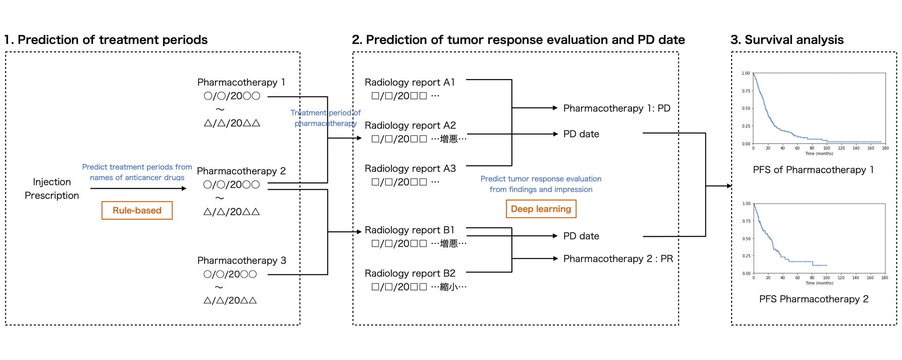

# jp-cancer-ehrs-analysis



## Notebook

See [`emr_analysis.ipynb`](emr_analysis.ipynb).

## Running the notebook

### Prerequisites

- [Docker](https://www.docker.com/)

### Directory structure

```
emr-analysis
├── Dockerfile
├── README.md
├── docker-compose.yml
├── emr_analysis/
│   ├── __init__.py
│   ├── abc/
│   │   ├── __init__.py
│   │   └── preprocessor.py
│   ├── config.py
│   ├── data.py
│   ├── effect/
│   │   ├── __init__.py
│   │   ├── dataset.py
│   │   └── detector.py
│   ├── evaluator.py
│   ├── preprocessor/
│   │   ├── __init__.py
│   │   ├── convert_newline.py
│   │   ├── strip.py
│   │   ├── trim_header.py
│   │   └── zenhan.py
│   ├── tokenizer.py
│   ├── treatment_period.py
│   └── util.py
├── emr_analysis.ipynb  # main notebook
├── figs/
│   └── overview.png
├── resources/
│   ├── config.yml
│   ├── data/
│   │   ├── emr/  # dummy EHRs data
│   │   │   ├── injection.csv
│   │   │   ├── prescription.csv
│   │   │   └── radiation_report.csv
│   │   ├── structured/  # dummy structured data
│   │   │   └── treatment_record.csv
│   │   └── word-embedding/
│   │       └── (fasttext.stanza.ja.300.vec.gz)  # Japanese fastText model built with Stanza
│   └── model/  # DNN model
│       ├── model.0.pt
│       └── model.1.pt
└── setup.py
```

### Preparing a word-embedding model

Download `fasttext.stanza.ja.300.vec.gz` from
[this release](https://github.com/xcoo/jp-cancer-ehrs-analysis/releases/tag/fasttext-model)
to `resources/data/word-embedding/` directory.

### Running

Launch Docker container for running JupyterLab.

```console
$ docker compose up -d
```

Open <http://localhost:8888/> in web browser and run `emr_analysis.ipynb`.
